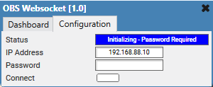
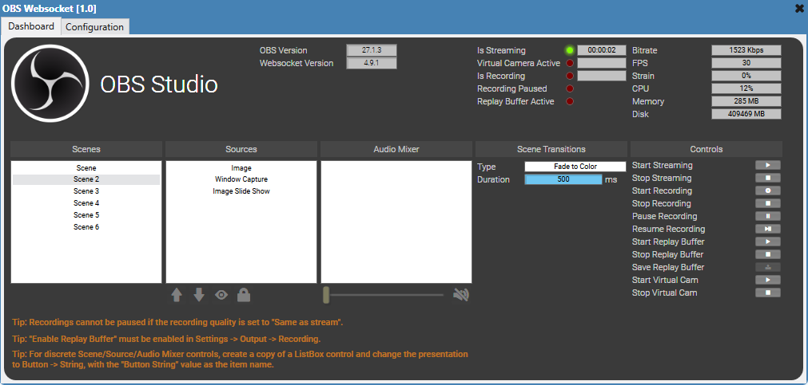

# OBS Websocket Remote Control

This is a Q-SYS Plugin for Control of Open Broadcaster Software (OBS) via the [Websocket Extension](https://github.com/obsproject/obs-websocket/releases/tag/4.9.1).

> Bug reports and feature requests should be sent to Jason Foord (jf@tag.com.au).

## How do I get set up?

See [Q-SYS Online Help File - Plugins](https://q-syshelp.qsc.com/#Schematic_Library/plugins.htm)

## Controls

### Configuration

#### Device Status

Displays the connection status of the Websocket.

#### IP Address

The IP Address of the machine running OBS Studio.

#### Password

The Password configured in the *Tools -> Websocket Server Settings* dialogue menu.

#### Connect

Toggles the Websocket connection.

### Dashboard

#### OBS Version

The detected version of the connected OBS Studio software.

#### Websocket Version

The detected version of the connected OBS Studio Websocket extension.

#### Scenes

Displays the list of available scenes. Selecting a scene will transition to the scene.

> Tip: For discrete controls, create a copy of the ListBox control and change the presentation to Button -> String, with the "Button String" value as the scene name.

#### Sources

Displays the list of available sources in the active scene. Selecting a source will update 'render' and 'locked' controls with the value corresponding to *this* source.

> Tip: For discrete controls, create a copy of the ListBox control and change the presentation to Button -> String, with the "Button String" value as the source name.

#### Audio Mixer

Displays the list of audio mixer sources in the scene. Selecting an audio source will update 'volume' and 'mute' controls with the value corresponding to *this* source.

> Tip: For discrete controls, create a copy of the ListBox control and change the presentation to Button -> String, with the "Button String" value as the audio source name.

#### Source Forward

Rearranges the sources by bringing the selected source forward one position.

#### Source Backward

Rearranges the sources by bringing the selected source backward one position.

#### Source Render

Sets the render state of the source.

#### Source Locked

Sets the locked state of the source.

#### Source Volume

Sets the volume of the audio source.

#### Source Mute

Sets the mute of the audio source.

#### Transition Type

Set the current direct cut transition.

#### Transition Duration

Sets the curren direct cut transition duration.

> Only applies to transition types that utilize a duration value.

#### Start Streaming

Attempts to start streaming.

#### Stop Streaming

Attempts to stop streaming.

#### Start Recording

Attempts to start recording.

#### Stop Recording

Attempts to stop recording.

#### Pause Recording

Attempts to pause recording.

> Tip: Recordings cannot be paused if the recording quality is set to "Same as stream".

#### Resume Recording

Resumes a paused recording.

#### Start Replay Buffer

Attempts to start the replay buffer.

> Tip: "Enable Replay Buffer" must be enabled in Settings -> Output -> Recording.

#### Stop Replay Buffer

Attempts to stop the replay buffer.

> Tip: "Enable Replay Buffer" must be enabled in Settings -> Output -> Recording.

#### Save Replay Buffer

Attempts to save the replay buffer.

> Tip: "Enable Replay Buffer" must be enabled in Settings -> Output -> Recording.

#### Start Virtual Camera

Attempts to start the virtual camera.

#### Stop Virtual Camera

Attempts to stop the virtual camera.

#### Is Streaming

Indicates if the stream is active.

#### Stream Timecode

Show the timecode of the current stream.

#### Is Recording

Indicates if the recording is active.

#### Recording Timecode

Show the timecode of the current recording.

#### Virtual Camera Active

Indicates if the virtual camera is active.

#### Virtual Camera Timecode

Show the timecode of the current virtual camera session.

#### Recording Paused

Indicates if the recording is paused.

#### Replay Buffer Active

Indicates if the replay buffer is active.

#### Stream Status Bitrate

Shows the bitrate of the active stream.

#### Stream Status FPS

Shows the fps of the active stream.

#### Stream Status Strain

Shows the strain of the active stream.

#### Stream Status CPU

Shows the cpu usage during an active stream.

#### Stream Status Memory

Shows the memory usage during an active stream.

#### Stream Status Disk

Shows the available disk space during an active stream.